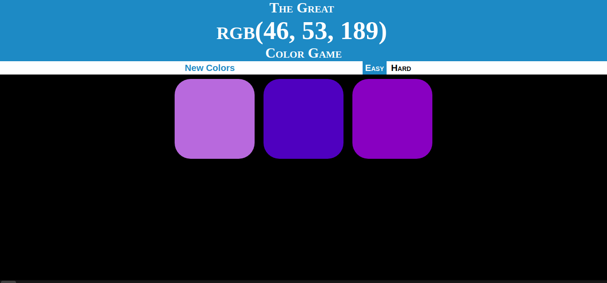
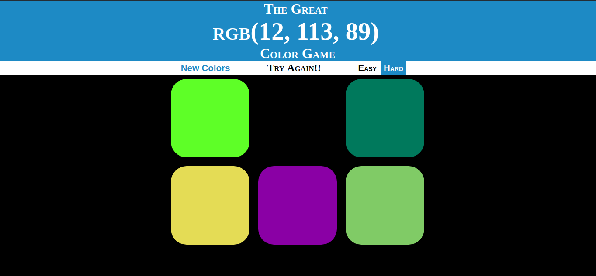
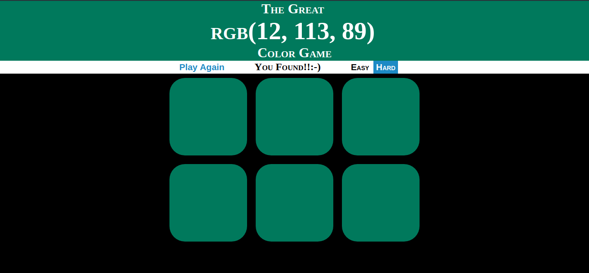
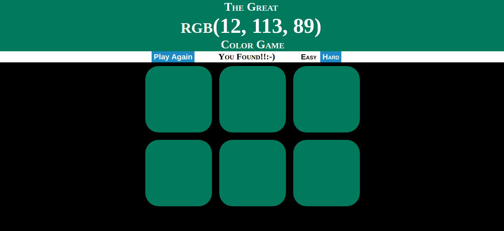

# Color Picker

## Introduction
Lisa set out to make a color picker memory game. After coding seamlessly for a few hours, she finally hit several hurdles slowing down her progress. Can you help her get past them?

## What does this project do?
Its a color picker project wherein you have to guess the right color shown on the tile based on the RGB values.

- The Demo video of the actual bug-free working website can be found [here](https://www.youtube.com/watch?v=oOTQyiusmGg).

## Task

Get the site functioning as expected. Below are the snapshots of the target website.

#### Easy Mode:

####  When Chosen Wrong Color:
When you click on the wrong color,the color fades out and gets removed.

#### When Chosen Right Color:
When you choose the right color,all the squares acquire the correct color as well as the header.

### To play Again
As you choose the right color the <strong>New Colors</strong> option changes to <strong>Play Again</strong> and you can play the game again with a new set of colors.

### New Game:

## How to run? 
Open `color_picker.html` in any browser of your choice to view the app. However, we recommend you to use Chrome+Chrome DevTools for the best debugging experience. 

