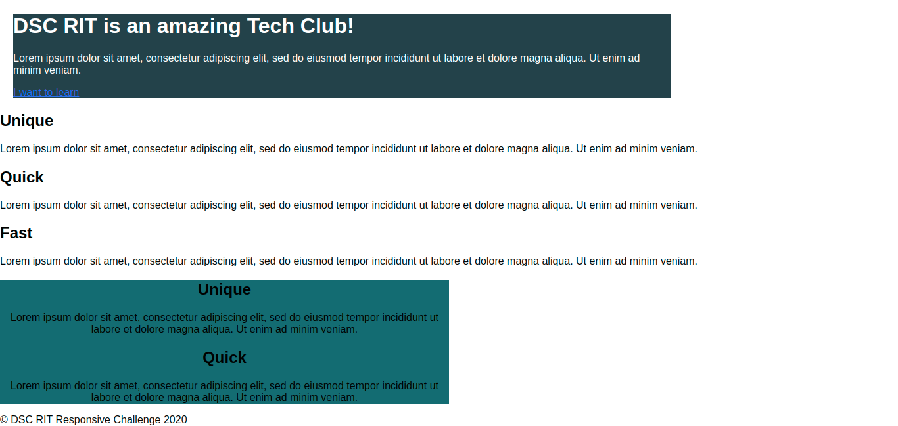
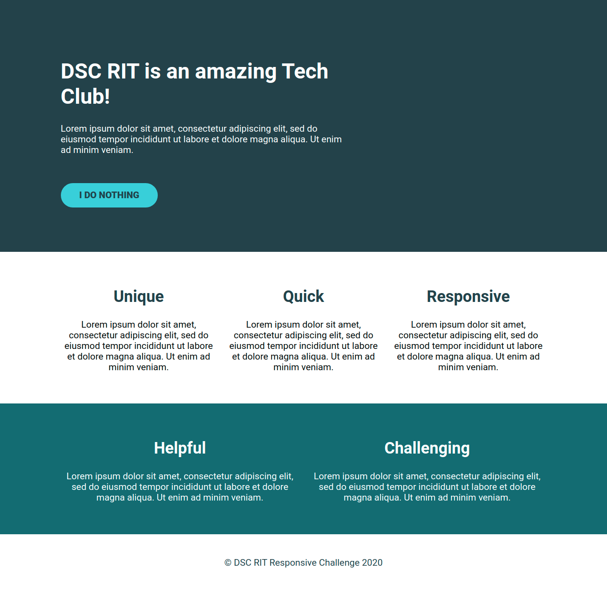

# Responsive Design Challenge

## Introduction
Ruby made her very first website and it looks great! However, the website is not mobile/resolution change friendly. Can you help her make the site responsive?   

## What does this project do?
It's a non-responsive website which holds some dummy information. Nothing much else to it really.

## Task

- The Introductory demo video of the actual bug-free working website can be found [here](https://www.youtube.com/watch?v=2ezuJnxugEc).

### Given Design

### Target Design

## How to run? 
Open `index.html` in any browser of your choice to view the app. However, we recommend you to use Chrome+Chrome DevTools for the best debugging experience. 
