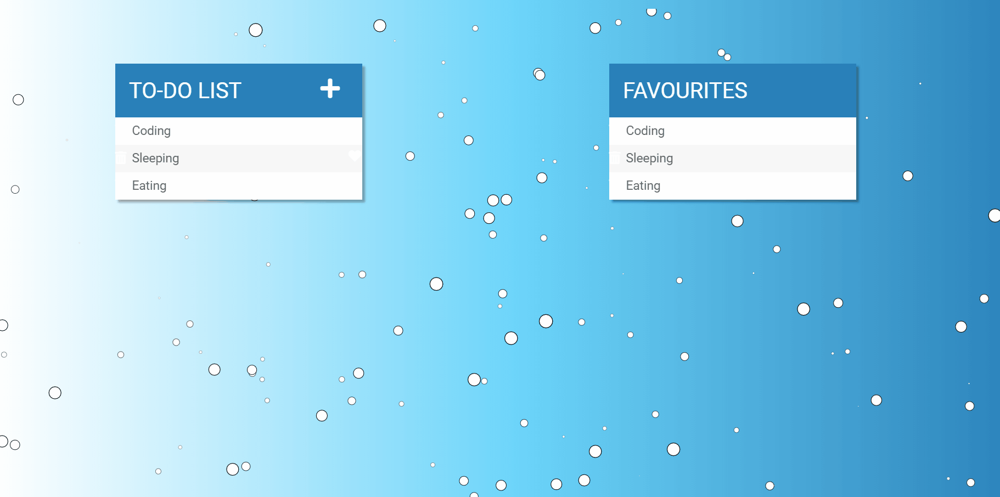
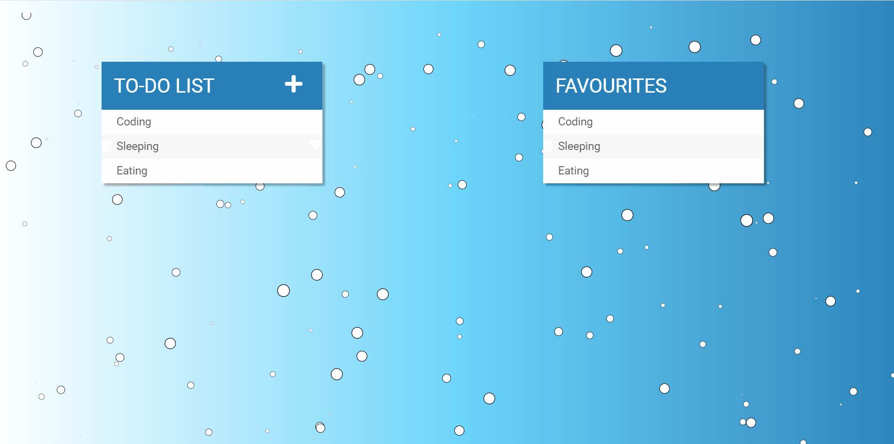
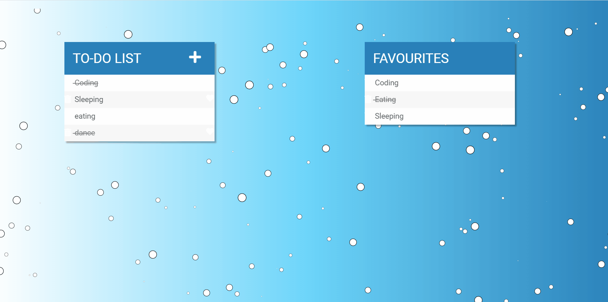
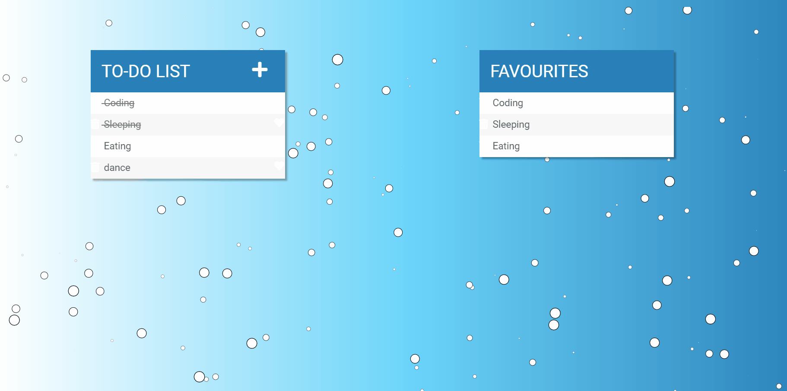

# TodoList Challenge

## Introduction
Alisha set out to make a TODO-list for herself. However, she quickly found herself in a pickle. Her TODO-list app is bug prone and not working as expected. Can you help her fix them? 

## What does the project do?
This project demonstrates a simple Todo-List application, with 2 lists. This list mentions all the tasks that you would need to remember on a day-to-day basis, complete with "Add Task", "Remove Task" and "Favorite Task functionality". 

## Task
Given an HTML file,a CSS file and a JS file, create a project similar to the target.

- The Introductory Demo video of the actual bug-free working website can be found [here](https://www.youtube.com/watch?v=fPBmvtiLx-o).

### Main interface To-do:

### Adding a  new todo:

### Typing the To-do in the input area and then clicking "Enter":

### When a task is done:

### Deleting a todo:

### Adding a todo to favourite list:

## How to run? 
Open `todo.html` in any browser of your choice to view the app. However, we recommend you to use Chrome+Chrome DevTools for the best debugging experience. 